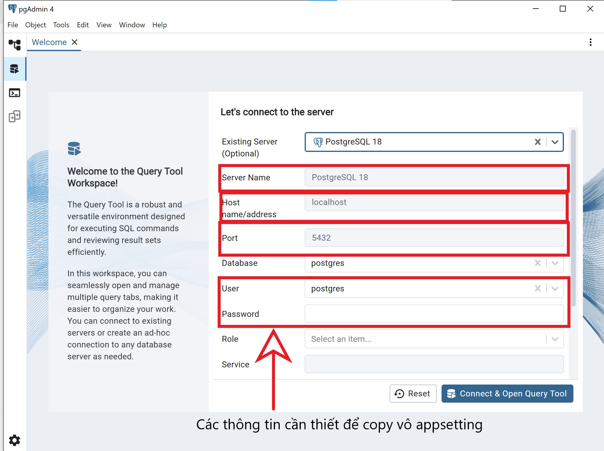
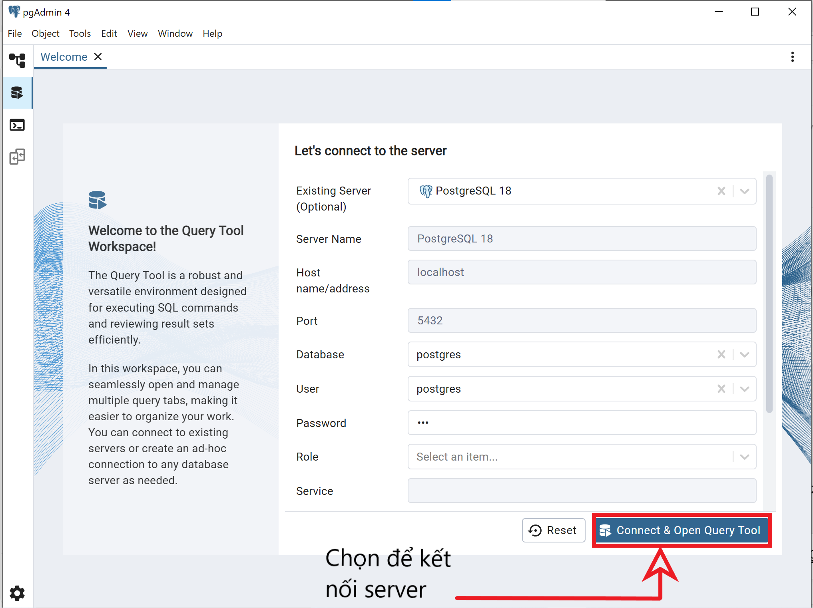
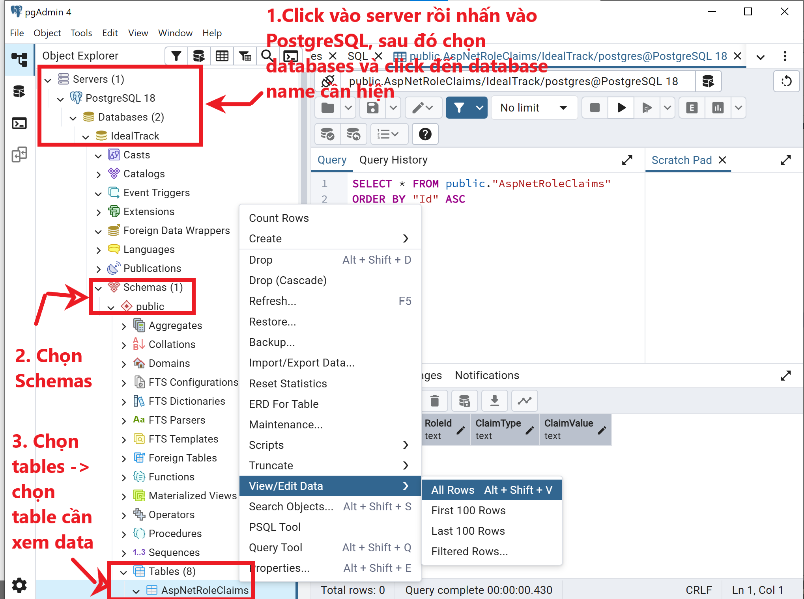

# Hướng dẫn Chuyển đổi Database sang PostgreSQL

Tài liệu này mô tả **đầy đủ các bước bắt buộc** để cấu hình dự án **ASP.NET Core 8** sử dụng **PostgreSQL** làm hệ quản trị cơ sở dữ liệu chính, thay thế cho SQL Server.

---

## Mục lục

1. Giới thiệu
2. Yêu cầu hệ thống
3. Cấu hình phiên bản Package (Bắt buộc)
4. Làm sạch Migrations cũ (SQL Server)
5. Cấu hình `Program.cs`
6. Cấu hình `appsettings.json`
7. Khởi tạo Database & Identity Tables
8. Lỗi thường gặp & cách xử lý
9. Ghi chú quan trọng

---

## 1. Giới thiệu

Khi chuyển từ **SQL Server** sang **PostgreSQL**, Entity Framework Core yêu cầu:

* Đồng bộ **phiên bản package**
* Xóa **Migration cũ** (do khác kiểu dữ liệu)
* Thay đổi **Database Provider**
* Tạo lại Migration & Database

Nếu bỏ qua bất kỳ bước nào, bạn có thể gặp lỗi như:

* `TypeLoadException`
* `Cannot cast type nvarchar to text`
* `The model backing the context has changed`

---

## 2. Yêu cầu hệ thống

* .NET SDK **8.0.x**
* PostgreSQL **>= 13**
* pgAdmin hoặc công cụ quản lý PostgreSQL tương đương
* Visual Studio 2022 (khuyến nghị)

---

## 3. Cấu hình Phiên bản Package (Bắt buộc)

## ⚠️ CỰC KỲ QUAN TRỌNG – EF CORE VERSION

⚠️ **Tất cả package Entity Framework Core BẮT BUỘC phải cùng phiên bản 8.0.11**
để tránh lỗi runtime `TypeLoadException`.

### ❌ Vì sao KHÔNG dùng EF Core 8.0.22?

Khi nâng EF Core lên **8.0.22**, NuGet sẽ **tự động kéo**
`Npgsql.EntityFrameworkCore.PostgreSQL` **lên version 9.0.x**.

👉 Trong khi project đang chạy trên:
- **.NET 8**
- **EF Core 8**
- Code + Migration viết theo EF Core 8

➡️ **Npgsql 9.0 chỉ tương thích EF Core 9**  
➡️ Dẫn tới **xung đột internal API** và ứng dụng **crash khi chạy**

Cập nhật file **`YourProject.csproj`** như sau:

```xml
<Project Sdk="Microsoft.NET.Sdk.Web">

  <PropertyGroup>
    <TargetFramework>net8.0</TargetFramework>
    <Nullable>enable</Nullable>
    <ImplicitUsings>enable</ImplicitUsings>
    <UserSecretsId>aspnet-PostgresSQL-405dd5c3-3f88-4b98-a7a2-093771214165</UserSecretsId>
  </PropertyGroup>

  <ItemGroup>
    <PackageReference Include="Microsoft.AspNetCore.Diagnostics.EntityFrameworkCore" Version="8.0.11" />
    <PackageReference Include="Microsoft.AspNetCore.Identity.EntityFrameworkCore" Version="8.0.11" />
    <PackageReference Include="Microsoft.AspNetCore.Identity.UI" Version="8.0.11" />

    <PackageReference Include="Microsoft.EntityFrameworkCore.Design" Version="8.0.11" />
    <PackageReference Include="Microsoft.EntityFrameworkCore.Tools" Version="8.0.11">
      <PrivateAssets>all</PrivateAssets>
      <IncludeAssets>runtime; build; native; contentfiles; analyzers; buildtransitive</IncludeAssets>
    </PackageReference>

    <PackageReference Include="Npgsql.EntityFrameworkCore.PostgreSQL" Version="8.0.11" />
  </ItemGroup>

</Project>
```

---

## 4. Làm sạch Migrations cũ (SQL Server)

Do PostgreSQL và SQL Server sử dụng **kiểu dữ liệu khác nhau**, bạn **bắt buộc phải xóa migration cũ**.

### Các bước:

1. Truy cập thư mục:

   ```
   /Data/Migrations
   ```

   hoặc

   ```
   /Migrations
   ```

2. Xóa **toàn bộ file `.cs`** trong thư mục này

> ❌ Không tái sử dụng migration SQL Server cho PostgreSQL

---

## 5. Cấu hình `Program.cs`

Thay đổi Database Provider từ **SQL Server** sang **PostgreSQL**.

### ❌ Trước đây (SQL Server):

```csharp
options.UseSqlServer(connectionString);
```

### ✅ Sau khi chuyển sang PostgreSQL:

```csharp
var connectionString = builder.Configuration.GetConnectionString("DefaultConnection")
    ?? throw new InvalidOperationException("Connection string 'DefaultConnection' not found.");

builder.Services.AddDbContext<ApplicationDbContext>(options =>
    options.UseNpgsql(connectionString));
```

---

## 6. Cấu hình `appsettings.json`

Cập nhật chuỗi kết nối PostgreSQL tương ứng với môi trường local:

```json
{
  "ConnectionStrings": {
    "DefaultConnection": "Host=localhost;Port=5432;Database=IdealTrack;Username=postgres;Password=123"
  },
  "Logging": {
    "LogLevel": {
      "Default": "Information",
      "Microsoft.AspNetCore": "Warning"
    }
  },
  "AllowedHosts": "*"
}
```

📌 **Giải thích nhanh**:

* `Host`: địa chỉ PostgreSQL (thường là `localhost`)
* `Port`: mặc định `5432`
* `Database`: tên database (PostgreSQL sẽ tự tạo)
* `Username`: user PostgreSQL
* `Password`: mật khẩu PostgreSQL

---

## 7. Khởi tạo Database & Identity Tables

### Bước 1: Mở Package Manager Console

```
Tools → NuGet Package Manager → Package Manager Console
```

### Bước 2: Tạo Migration mới

```powershell
Add-Migration initPostgreSql
```

### Bước 3: Áp dụng vào Database

```powershell
Update-Database
```

Sau bước này, PostgreSQL sẽ được tạo đầy đủ:

* Bảng `AspNetUsers`
* Bảng `AspNetRoles`
* Bảng `AspNetUserRoles`
* Các bảng Identity liên quan

---

## 8. Lỗi thường gặp & Cách xử lý

### ❌ Lỗi: `TypeLoadException`

**Nguyên nhân**:

* Package EF Core không cùng version

**Cách fix**:

* Đảm bảo **tất cả** package = `8.0.11`

---

### ❌ Lỗi: `Add-Migration` không nhận diện

**Cách fix**:

```bash
dotnet tool install --global dotnet-ef
```

Sau đó restart Visual Studio.

---

### ❌ Lỗi: `relation \"AspNetUsers\" does not exist`

**Nguyên nhân**:

* Chưa chạy `Update-Database`

---

## 9. Ghi chú quan trọng

## CÁC THÔNG TIN ĐỂ LƯU APP SETTING



---

## CÁCH KẾT NỐI POSTGRESQL



---

## CÁCH XEM DATA


---

## ✅ Kết luận

Sau khi hoàn tất các bước trên, dự án ASP.NET Core 8 của bạn sẽ:

* Hoạt động hoàn toàn với **PostgreSQL**
* Sử dụng **EF Core + Identity** ổn định
* Dễ dàng mở rộng cho môi trường Production

---

📌 *Tài liệu này dùng cho mục đích học tập & triển khai nội bộ.*

---

## 10. Code mẫu hoàn chỉnh

### 10.1 `Program.cs`

```csharp
using Microsoft.AspNetCore.Identity;
using Microsoft.EntityFrameworkCore;
using YourProject.Data;

var builder = WebApplication.CreateBuilder(args);

var connectionString = builder.Configuration.GetConnectionString("DefaultConnection")
    ?? throw new InvalidOperationException("Connection string 'DefaultConnection' not found.");

builder.Services.AddDbContext<ApplicationDbContext>(options =>
    options.UseNpgsql(connectionString));

builder.Services.AddDatabaseDeveloperPageExceptionFilter();

builder.Services.AddDefaultIdentity<IdentityUser>(options => options.SignIn.RequireConfirmedAccount = false)
    .AddEntityFrameworkStores<ApplicationDbContext>();

builder.Services.AddControllersWithViews();

var app = builder.Build();

if (app.Environment.IsDevelopment())
{
    app.UseMigrationsEndPoint();
}
else
{
    app.UseExceptionHandler("/Home/Error");
    app.UseHsts();
}

app.UseHttpsRedirection();
app.UseStaticFiles();

app.UseRouting();

app.UseAuthentication();
app.UseAuthorization();

app.MapControllerRoute(
    name: "default",
    pattern: "{controller=Home}/{action=Index}/{id?}");
app.MapRazorPages();

app.Run();
```

### 10.2 `ApplicationDbContext.cs`

```csharp
using Microsoft.AspNetCore.Identity.EntityFrameworkCore;
using Microsoft.EntityFrameworkCore;

namespace YourProject.Data;

public class ApplicationDbContext : IdentityDbContext
{
    public ApplicationDbContext(DbContextOptions<ApplicationDbContext> options)
        : base(options)
    {
    }
}
```

### 10.3 Lệnh CLI (tùy chọn)

```bash
dotnet ef migrations add init_postgresql

dotnet ef database update
```
